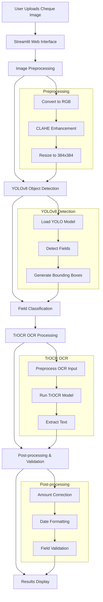

# Cheque Detection System Architecture

## Overview
This document provides a comprehensive overview of the Cheque Detection System architecture, detailing the workflow from cheque image upload to field extraction and validation.

## System Architecture Flow


## Component Details

### 1. Frontend (Streamlit)
- Web interface for cheque image upload
- Real-time image display
- Results visualization
- Built using Streamlit framework

### 2. Image Preprocessing
- Converts images to RGB format
- Applies CLAHE enhancement for better contrast
- Resizes images to 384x384 pixels
- Handles various image formats (jpg, png, jpeg)

### 3. YOLOv8 Object Detection
- Custom trained YOLOv8 model
- Detects multiple cheque fields
- Generates bounding boxes
- Classifies fields (e.g., Amount, Date, MICR Code)

### 4. TrOCR OCR Processing
- Uses Microsoft's TrOCR model
- Specialized for handwritten text recognition
- Processes each detected field
- Extracts text content

### 5. Post-processing
- Amount correction (handles common OCR errors)
- Date formatting (standardizes to DD/MM/YYYY)
- Field validation (ensures correct data types)
- Special handling for numeric fields

### 6. Results Display
- Shows original cheque image
- Highlights detected fields
- Displays extracted text
- Shows validation results

## Technical Stack
- **Framework**: Streamlit
- **Object Detection**: YOLOv8
- **OCR**: TrOCR (Microsoft)
- **Image Processing**: OpenCV, Pillow
- **Data Processing**: NumPy, PyTorch

## Data Flow
1. User uploads cheque image through Streamlit interface
2. Image is preprocessed for better detection
3. YOLOv8 detects and classifies cheque fields
4. TrOCR processes each field for text extraction
5. Results are post-processed and validated
6. Final results are displayed to the user

## Error Handling
- Invalid image formats are rejected
- Failed detections are logged
- OCR errors are corrected where possible
- Invalid date formats are handled gracefully

## Security Considerations
- Input validation for uploaded images
- Secure handling of sensitive cheque data
- Proper model loading and memory management

## Future Enhancements
- Additional field detection capabilities
- Improved OCR accuracy
- Enhanced validation rules
- Support for multiple cheque formats
- Batch processing capability
```
