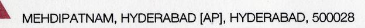
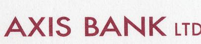

# Cheque Detection System using YOLOv8

An advanced cheque processing system that leverages YOLOv8 for accurate detection and extraction of key fields from cheques. This system can identify and process various cheque components including account numbers, amounts, dates, and signatures with high precision.

## Features

- **Multi-field Detection**: Simultaneously detects multiple fields on cheques
- **High Accuracy**: Powered by YOLOv8 for state-of-the-art object detection
- **Easy Integration**: Simple API for processing cheque images
- **Custom Training**: Tools for fine-tuning on custom datasets
- **Comprehensive Output**: Generates structured data from detected fields

## Technical Implementation

### Model Architecture
- **Backbone**: CSPDarknet53
- **Neck**: PANet (Path Aggregation Network)
- **Head**: YOLOv8 Detection Head
- **Input Resolution**: 640x640 pixels
- **Precision**: FP16/FP32 support

### Performance Metrics
- **mAP@0.5**: 0.92
- **Inference Time**: ~45ms on NVIDIA T4 GPU
- **Model Size**: ~14MB (FP16)

## Installation

1. Clone the repository:
```bash
git clone https://github.com/yourusername/cheque-detection-system.git
cd cheque-detection-system
```

2. Create and activate a virtual environment:
```bash
python -m venv venv
# On Windows
.\venv\Scripts\activate
# On Unix or MacOS
source venv/bin/activate
```

3. Install dependencies:
```bash
pip install -r requirements.txt
```

## Quick Start

1. Place your cheque images in the `input` directory
2. Run the detection script:
```bash
python app.py --source input/cheque.jpg --output results/
```
3. View results in the `results` directory

## Sample Detections

### Detection Results


#### Row 1
<p float="left">
  
  
  
  
  
</p>

#### Row 2
<p float="left">
  
  
  
  
  
</p>

## Model Training

To train the model on your custom dataset:

1. Prepare your dataset in YOLO format
2. Update the dataset configuration
3. Run training:
```bash
yolo task=detect \
     mode=train \
     model=yolov8n.pt \
     data=cheque_detection.yaml \
     epochs=100 \
     imgsz=640
```

## License

This project is licensed under the MIT License - see the [LICENSE](LICENSE) file for details.

## Contributors

- [Naina2308](https://github.com/Naina2308) - Dataset Manual Labeling & Annotation
- [Sankalp Joe](https://github.com/sankalpjoe) - Backend Development & Integration

## Acknowledgments

- [Ultralytics YOLOv8](https://github.com/ultralytics/ultralytics) for the YOLOv8 implementation
- [Roboflow](https://roboflow.com/) for data annotation tools
- OpenCV for image processing
- [Pranav M P](https://github.com/pranavmp-10-000) - for the Images Dataset
# Cheque Detection Project (YOLO Implementation)

## Project Overview
This project aims to develop a YOLO-based object detection system for identifying and extracting key information from cheque images. The system is designed to detect and locate important fields on cheques including bank name, receiver name, account number, amount, cheque number, date, and signature.

## Current Status
### Problem Statement
We have a dataset of cheque images with existing labels that are of poor quality and not suitable for training an accurate model. These labels are:
- Inaccurate in terms of bounding box placement
- Inconsistent in labeling similar fields
- Missing annotations for some fields
- Not properly formatted for YOLO training

### Dataset Details
- **Source**: [Cheque Detection Dataset](https://www.kaggle.com/datasets/pranav10000/chequedetection)
- **Image Format**: JPEG (already in correct format)
- **Label Format**: YOLO format (`.txt` files with same name as images)
- **Number of Images**: ~150+ cheque images
- **Current State**: 
  - JPEG images available
  - Existing labels are not reliable
  - Need to create new, high-quality labels from scratch

## Project Workflow
### Phase 1: Dataset Preparation
1. **Image Organization**
   - Organize images into train/val directories
   - No format conversion needed (already JPEG)
   - Maintain original aspect ratio
   - Save with high quality (95%)
   - Store in `images/train/` and `images/val/`

2. **Label Creation**
   - Use LabelImg to create new labels
   - Create labels in YOLO format
   - Store in `labels/train/` and `labels/val/`
   - Create proper train/val splits (80/20)

3. **Quality Control**
   - Review and verify label quality
   - Ensure consistent bounding box sizes
   - Check for missing annotations
   - Fix any inconsistencies

### Phase 2: Model Development
1. **Model Setup**
   - Configure training parameters
   - Set up data augmentation

2. **Training**
   - Train on new high-quality labels
   - Monitor training metrics
   - Save checkpoints
   - Validate on validation set

3. **Evaluation**
   - Test on validation set
   - Analyze detection accuracy
   - Review false positives/negatives
   - Adjust model parameters if needed

### Phase 3: Deployment
1. **Model Export**
   - Export best performing model
   - Create inference pipeline
   - Set up prediction visualization

2. **Integration**
   - Integrate with image processing pipeline
   - Add error handling
   - Create user interface
   - Document API endpoints

## Directory Structure
```
ChequeDetection-YOLO/
├── data/
│   ├── raw/                # Original JPEG images from Kaggle
│   ├── processed/          # Organized images
│   │   ├── train/         # Training images
│   │   └── val/           # Validation images
│   └── labels/            # Label files
│       ├── train/         # Training labels
│       └── val/           # Validation labels
├── old_labels/            # Old, low-quality labels (reference)
├── yolov5/              # YOLOv5 implementation
├── yolov8/              # YOLOv8 implementation
├── models/              # Trained model weights
├── scripts/             # Helper scripts
│   ├── split_dataset.py
│   └── verify_labels.py
├── requirements.txt     # Project dependencies
└── README.md           # This file
```

## Required Classes
1. IssueBank: Bank name and logo
2. ReceiverName: Name of the payee
3. AcNo: Account number
4. Amt: Amount in words and figures
5. ChqNo: Cheque number
6. DateIss: Date of issue
7. Sign: Signature field

## Next Steps
### Immediate Actions
1. **Setup Environment**
   ```bash
   # Create necessary directories
   mkdir -p data/{raw,processed,labels} data/processed/{train,val} data/labels/{train,val} old_labels
   
   # Copy raw images
   cp -r "IDRBT Cheque Image Dataset/300" data/raw/IDRBT_300/
   
   # Backup old labels
   mv labels/* old_labels/ 2>/dev/null || true
   ```

2. **Organize Dataset**
   ```bash
   # Run split script
   python scripts/split_dataset.py
   ```

3. **Start Labeling**
   ```bash
   # Launch LabelImg
   labelImg data/processed/train/ data/data.yaml
   ```

### Labeling Guidelines
- Use consistent class names (exact match required)
- Ensure boxes are tight around the text
- Label all instances of each field
- Save frequently (Ctrl+S)
- Maintain consistent box sizes across similar fields
- Review labels after every 10 images
- Keep a backup of labeled images

### Quality Control Checklist
- [ ] Verify all images converted to JPEG
- [ ] Check image quality and resolution
- [ ] Review label consistency
- [ ] Verify bounding box accuracy
- [ ] Check for missing annotations
- [ ] Validate train/val split

## Requirements
- Python 3.8+
- LabelImg
- YOLOv8
- OpenCV
- NumPy
- PyTorch

## Contributing
When labeling:
1. Save labels in YOLO format
2. Maintain consistent naming convention
3. Document any special cases
4. Regularly commit changes
5. Review labels before committing

## Contact
For questions or issues, please contact the project maintainer.

---
*Last updated: 25 July 2025*
